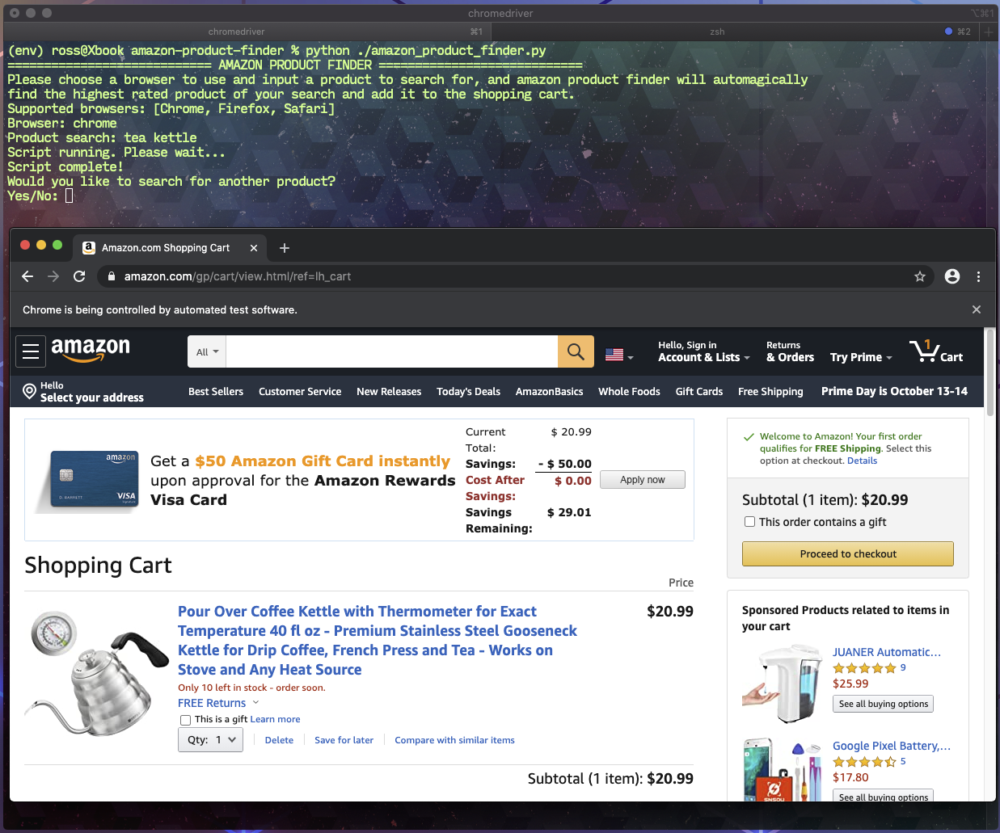

# amazon product finder
> Script for automation of finding highest average rated amazon products of your choice.

Amazon product finder is a selenium driven, python based script that will prompt user for a product to search for, and then find the highest average rated product from said search. Once the product is found it will then be added to the cart. This is designed to work with Chrome, Firefox and Safari. 



### Script workflow
- Prompt user for browser choice and product search
- Open up web browser
- Navigate to amazon
- Search for product
- Adjust filter for best avg review
- Add item to cart
- Navigate to cart
- Prompt user if they would like an additional search, and close out of browser + script if not.

## Environment Setup

1. In order to utilize Selenium webdriver with a browser, you will need to install the browser webdriver files. See links below with instructions for each web browser.
- [Google Chrome][chrome]
- [Firefox][firefox]
- [Safari][safari]

2. Install Python (mac-oriented)  
*First, install homebrew*  
```/bin/bash -c "$(curl -fsSL https://raw.githubusercontent.com/Homebrew/install/master/install.sh)"```  
*Install Python 3 via homebrew*  
```brew install python```  

3. Set up virtual environment (recommended, not required)  
*Version/path dependent on your Python installation*  
```python3 -m pip install --user virtualenv```  
```python3 -m venv env```  

4. Activate virtual environment from working directory in repository  
```source env/bin/activate```  

5. Download requirements.txt file to your working repository, then install required packages via pip  
```pip install -r requirements.txt```

## Running the application  
```python main.py```

<!-- Markdown link & img dfn's -->
[chrome]: https://chromedriver.chromium.org/getting-started
[firefox]: https://www.guru99.com/install-selenuim-ide.html
[safari]: https://developer.apple.com/documentation/webkit/testing_with_webdriver_in_safari
